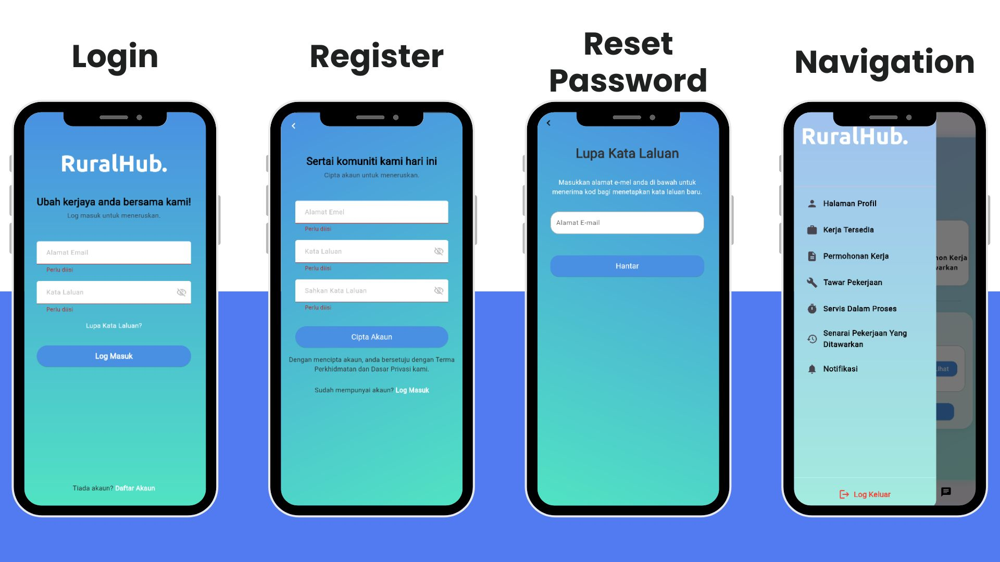
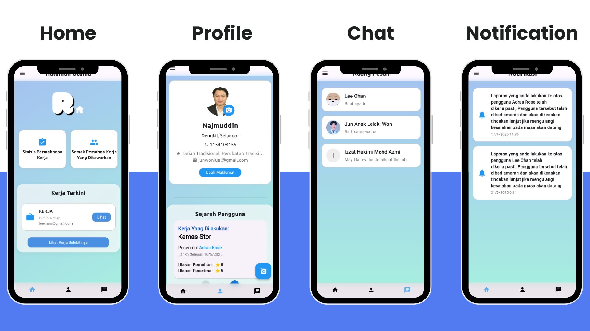
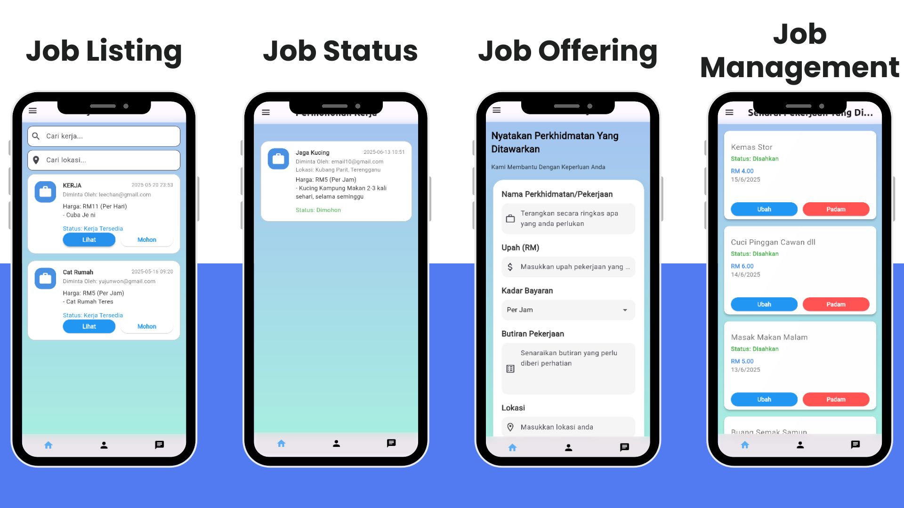

# RuralHub
> A Malaysian Local Job Marketplace Focusing on Rural Communities

## Overview
RuralHub is a revolutionary job marketplace platform connecting skilled rural Malaysian workers with employment opportunities, fostering economic growth in underserved areas.

## Mission
Empowering rural Malaysian communities through an accessible digital platform for showcasing skills, finding work opportunities, and building sustainable livelihoods.

## Features

### Core Functionality
- **Job Marketplace**: Post and find local job opportunities
- **Rural-Friendly Platform**: Implementing Malay Language UI
- **Simplified UX**: Intuitive interface for all technical skill levels

### For Clients
- Detailed job request system
- Real-time progress tracking
- Multi-image upload support
- Feedback system

### Community Tools
- Chat system
- Job proposal system


### Supported Platforms
- **Android**: Version 5.0 (Lollipop) or higher
- **Web**: Modern browsers (Chrome, Firefox, Safari)

### System Requirements
- Storage: 60MB minimum
- Network: 3G connection or better
- Valid email/phone for registration

### Installation
Download the latest release: [v2.1](https://github.com/izzathakimi/henshin/releases/tag/v2.0)

## Getting Started

### Development Setup
1. Install prerequisites:
   - Flutter SDK
   - Git
   - Firebase CLI
   - VS Code or Android Studio

2. Clone and configure:
   ```bash
   git clone [repository-url]
   cd [project-directory]
   flutter pub get
   ```

3. Firebase configuration:
   - Create project at [Firebase Console](https://console.firebase.google.com/)
   - Run `flutterfire configure`
   - Add platform-specific files:
     - Android: `google-services.json` in `android/app/`
     - iOS: `GoogleService-Info.plist` in `ios/Runner/`

4. Launch project:
   ```bash
   flutter clean
   flutter pub get
   flutter run
   ```

## Firebase Integration
- Authentication services
- Real-time database
- Cloud storage
- Analytics and monitoring

## Privacy & Security
- Customizable visibility settings
- Location sharing controls
- Communication preferences
- Data management options

## Demo
RuralHub Mobile Application User Manual: [Click Here](https://drive.google.com/file/d/16Byy0uySTTJJ45Hg9cVGZ9QSC2WHZcvL/view?usp=drive_link)

### Authentication Flow


Login, register, forgot password and profile details screens

### Main Application Screens


Key application interfaces showing the home page with recent job listings, buttons for checking applied job status and offered job status, Profile page with account history and posts, messaging system, and notification page.

### Service Management Screens


Core service interfaces displaying user job request system, available jobs listing, and the job application process in Malay language for better accessibility

## Support
- Email: izzathakimi0204@gmail.com
- Video tutorials (Outdated)
- [Video Demonstration](https://drive.google.com/file/d/1DZTsQfl9j8VxcaiaYoL35buBXUqAVnZI/view?usp=sharing)

---

Built with ❤️ for rural Malaysia